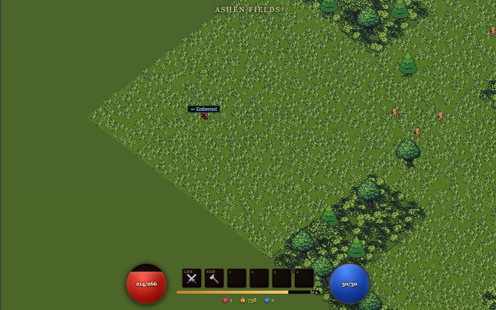

# Ashfall

A single-player action RPG in the spirit of **Diablo 2** with **Path of Exile**
influence, built on the GUTS engine (forked from HeroArena).



## Quick Start

```bash
# Build
npm run build -- Ashfall

# Serve
node projects/Ashfall/server.js

# Play
# open http://localhost:3000/index.html → ENTER BATTLE → Adventure → pick a class
```

## Controls

| Input | Action |
|-------|--------|
| **WASD** | Move (camera-relative) |
| **Mouse** | Aim |
| **Left click (hold)** | Basic attack toward cursor |
| **Right click / 1–4** | Cast bound skills |
| **Q / E** | Drink life / mana potion |
| **C / I / T / J** | Character / Inventory / Skill tree / Quest log |
| Click ground labels | Pick up loot, use portals/waypoints, talk to NPCs |

## The Game

- **6 classes** on the STR/DEX/INT triangle — Barbarian, Soldier, Archer, Scout,
  Apprentice, Acolyte — each with a 3-branch skill tree and **3 ascension classes**
  unlocked at level 12 (e.g. Barbarian → Berserker / Gladiator / Warlord; ascending
  transforms your character into its tier-2 form).
- **D2-style items**: Normal/Magic/Rare/Unique rarities, prefix+suffix affixes with
  ilvl tiers, attribute/level requirements, sockets, ground labels, vendors, stash.
- **PoE-style gems**: skill gems grant extra abilities while socketed in equipped
  items; support gems add modifiers. The whole stat pipeline uses PoE-style tagged
  `increased`/`more` damage modifiers.
- **WFC level generation**: wilderness zones are stitched from hand-authored 8×8
  tile-group pieces (60 pieces across forest/rock/brick sets) by wave function
  collapse with edge-socket constraints — every zone layout is different.
- **Act 1**: the town of **Emberrest** (Warlord Kael, Mira the Smith, Elder Rowan,
  stash, waypoint) and a 5-zone chain — Ashen Fields → Charred Woods → Cinder
  Quarry → Ashfall Keep Approach → The Ember Throne — with a 4-quest chain
  ending at **Pyrelord Vazruk**, the act boss. Champion packs, named zone bosses,
  waypoint travel.

See [DESIGN.md](DESIGN.md) for the full design document.

## Tests

Puppeteer end-to-end suites (need the server running and `npm i --no-save puppeteer`):

```bash
node projects/Ashfall/test_adventure.mjs   # 45-check systems regression
node projects/Ashfall/test_act1.mjs        # full Act 1 fast-forward playthrough
```

## Notable Source

| Path | What |
|------|------|
| `collections/scripts/systems/js/Arpg*.js` | ARPG core (game, controller, stats, HUD, UI, loot) |
| `collections/scripts/systems/js/{SkillTree,Item,Zone,EnemyPack,Quest,Npc}System.js` | Progression, items, world, monsters, quests |
| `collections/scripts/libraries/js/WFCLevelGenerator.js` | Wave function collapse |
| `collections/data/{classes,skillTrees,itemBases,affixes,uniqueItems,gems,zones,quests,npcs}` | Game data |
| `collections/terrain/levels/piece_*` | Authored WFC tile-group pieces |
| `collections/terrain/levels/town_emberrest.json` | The town |
